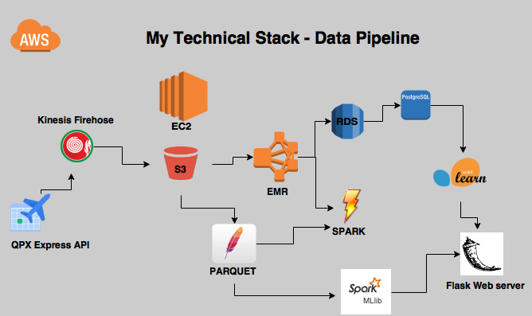

## Data Engineering Final Project - Overview

## Business Problem

    * Buying the cheapest fare possible to a round trip

# The "5Ss"
    * Streaming
    * Storing
    * Structuring
    * Synthesizing
    * Show

## Pipeline 

One can follow the step-by-step approach to this project on the following notebooks:
* 0 - Collect Data From API
* 1 - Spinning up an EMR cluster
* 2 - Creating a Postgres DB and Connecting to it
* 3 - Machine Learning

# Streaming

### Streaming data from REST API 
**QPX Express API (Flight Fares) **

    * Send HTTP POST request to API endpoint: https://www.googleapis.com/qpxExpress/v1/trips/search
    * more info at 0 - Collect Data From API.ipynb
    
### Kinesis

    * Setup Kinesis firehose on AWS using boto3 to pull data from API
    * Specify the S3 bucket that I want to direct the firehose to in S3
    * Set up a cronjob to run api_checks.py every 30 minutes in EC2 instance

# Storing

    * Data lake on S3 bucket

# Structuring  

### Apache Parquet

    * Read raw data from S3
    * Create Spark dataFrames in 3 NF
    * Store them in a different bucket in S3 as Parquet file 

### RDS - PostgreSQL

    * Create 2 tables (International vs National) via pgAdmin
    * Read data into each table using a spark script

# Synthesizing

    * ML Lib
    * Scikit-Learn

# Show

    * Run Flask on a new EC2 instance, use the app.py.

-------
 
# 8 properties for Big Data systems :

## Robustness and fault Tolerance
The pipeline was architected in a way that means that any failure of any stage in the pipeline downstream of the collector is recoverable: because it is always possible to spin up a big EMR cluster and reprocess the raw collector logs from scratch.

## Low latency reads and updates
Kinesis allows for quick and simple data storage into S3. Spark also speeds up the ETL processing of unstructured data in S3 to structured data in RDS.

## Scalability
I do not have a high volume of data, but in case that increases, S3 is good enough to hold huge amount of data.

## Generalization
This architecture can be reused for a lot of applications. Especially for using another API or webscraping.

## Extensibility
Apart from the sysytems that store the raw data, any of the system can be replaced with a better ones if there are any available, or may be for a different application, using the same data.

## Ad hoc queries
PostgreSQL will be used to do ad hoc queries.

## Minimal maintainance
As all the components are maintained AWS, there is very less to worry about interms of maintainance.

When it comes to scale, the postgresql can be of a problem. This an be replaced with an appropriate rdbms system

## Debuggability
Later on, I plan on adding checkpoints for the pipeline such as email to notify the amount/count of data that has been collected or to notify if a cron job has failed to run. 
